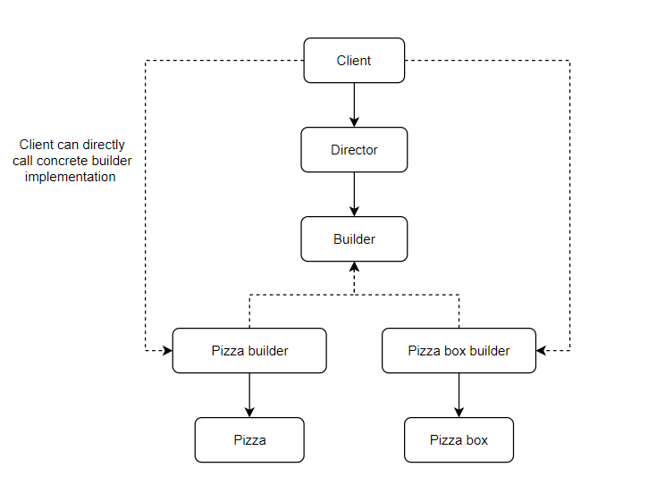
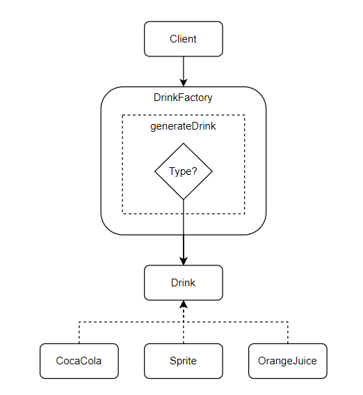

# SOLID-principles-and-design-patterns

**Solid Principles :** SOLID is actually an acronym which represent 5 different design principles
<ol>
<li>Single responsibility principle</li>
<li>Open close principle</li>
<li>Liskov substitution principle</li>
<li>Interface segregation principle</li>
<li>Dependency inversion principle</li>
</ol>

*Note: There are not the only design principles you need to know, but these are one of the most important ones.*
<br><br>
**The example code mentioned in respective sections below or in the repository are just to explain the concepts, they might not follow proper coding structure or the best practice.*
<hr>

## SOLID - Principles

### 1. Single responsibility principle
**Definition :** Single responsibility principle tells us that there should never be more than one reason for a class to change.<br>
In simple word, a class must provide very focused functionality, or it should address a very specific concern of the desired functionality.<br>
For example, let's say we have written a big code in a single class and that code communicate with server or another microservice. 
Now as all the code is present in a single calss, there can be multiple reasons which can cause changes in the code/class, like
<ul>
<li>Messaging format changes i.e. initially we were sending the request payload in JSON format, and now we have to send in XML format.</li>
<li>Parameter in the payload changes, i.e. we are sending additional information/fields in payload like Authentication parameter.</li>
</ul>

So in such cases, our code which is written in a single class is going to be changed. 
Means there are more than one reason which can cause changes in the class, this is what single responsibility principle suggest to avoid.
If we have 2 different responsibilities then we must have two different classes to handle those responsibilities so that whenever something is changed, 
we can change our code in systematic manner.<br><br>


To understand actual code which demonstrate the violation of single responsibility violation principle see the code in '[solid - 01.a - single-responsibility-violation](https://github.com/Akhil-Selukar/SOLID-principles-and-design-patterns/tree/master/solid%20-%2001.a%20-%20single-responsibility-violation)' project.<br><br>
*Note : consider this as a spring boot mvc code where the request to controller is considered to be generated from main method and 
in place of storing the comment data in database we have mocked the data with hashMap*

if you see *[CommentController.class](https://github.com/Akhil-Selukar/SOLID-principles-and-design-patterns/blob/master/solid%20-%2001.a%20-%20single-responsibility-violation/src/main/java/com/solid/principles/controller/CommentController.java)* the 
logic to validate the payload is implemented in the controller itself, also we are creating the comment object from JSON payload as well in the controller
<br><br>
Validation logic:
```java
private boolean validateComment(Comment comment) {
        if(!isPresent(comment.getMessage())) {
            return false;
        }
        if(comment.getAuthor() == null || comment.getAuthor().trim().length() == 0) {
            return false;
        }
        return true;
    }

    private boolean isPresent(String value) {
        return value != null && value.trim().length() > 0;
    }
```
<br>
Creating object from JSON payload:

```java
ObjectMapper mapper = new ObjectMapper();
Comment comment = mapper.readValue(payloadJson, Comment.class);
```

so if the validation rules changes or if the parsing mechanism changes, or we changed payload from json to some other form, all this
scenarios will cause changes in controller class. Means controller class has more than one responsibility which is violating the 
single responsibility principle. Ideally responsibility of controller must br to rout the request to appropriate service/business logic in service layer.<br><br>

Now, consider the code in '[solid - 01.b - single-responsibility-compliant](https://github.com/Akhil-Selukar/SOLID-principles-and-design-patterns/tree/master/solid%20-%2001.b%20-%20single-responsibility-compliant)' project.
Here controller class only is routing the request to the service layer, service layer has only business logic, 
validation logic is transferred to the util package (PayloadValidator.class) and repository class only have one responsibility 
to store data in database. Here each and every layer or class is focused on only one functionality and if anything changes 
then we can specifically change the code inside respective class.

### 2. Open close principle
**Definition :** Open close principle states that the software entities like method, class or modules should be open for 
extension but close for modification.<br>
In simple word it means if we have a base class completely working and tested then we should be able to extend that class
to add new behaviors or override the methods (i.e. open for extension), but we must not modify the code written in base 
class because that is already tested and working. By changing base class code we might break some other functionality.
<br>

The code present in '[solid - 02.a - open-close-violation](https://github.com/Akhil-Selukar/SOLID-principles-and-design-patterns/tree/master/solid%2002.a%20-%20open-close-violation)'
describes the code which violates the open close principle. Here for both Tata Nexon and Honda Activa we have declared engine type, seating capacity,
number of wheels and showroom price, also we have a method to calculate on road price for both of them. 
Those methods have their own implementation. Here we can clearly see that we are repeating most of the code so what 
we can do is crete a base class which has all the above-mentioned property and add an abstract method to calculate on road price
as shown in '[solid - 02.b - open-close-compliant](https://github.com/Akhil-Selukar/SOLID-principles-and-design-patterns/tree/master/solid%2002.b%20-%20open-close-compliant)'
By this what we are doing is we have our base class which can be extended by another classes and add extra fields or 
functionalities, meaning open for extension. But at the same time we don't have to change the base class to add any other vehicle, meaning 
the base class is not closed for modification. Here the abstract method is the way for extension of base class.

### 3. Liskov substitution principle
**Definition :** Liskov substitution principle states that we should be able to use subclass or child class object wherever base class object is expected.
And this substitution should not alter desired properties/behaviour of the program.<br>
For an example in simple words, if we have a base class and it is providing us 'xyz' behaviour. Now we replace the object of base class
with an object of child class or subclass, by this substitution the 'xyz' feature must not be changed.<br>

The code present in '[solid - 03.a - liskov-substitution-violation](https://github.com/Akhil-Selukar/SOLID-principles-and-design-patterns/tree/master/solid%2003.a%20-%20liskov-substitution-violation)'
shows the violation of liskov substitution principle. Here we have two classes 'Square.class' and 'Rectangle.class' and we can 
say that square is a special type of rectangle where height and width is always equal. Hence, irrespective of what we are
 setting (height or width) for square we are internally making sure that at all the time both must be equal (by using setSide() method) 
```java
public class Square extends Rectangle{

    public Square(int side) {
        super(side, side);
    }

    public void setWidth(int width) {
        setSide(width);                     // call to setSide() method
    }

    public void setHeight(int height) {
        setSide(height);                    // call to setSide() method
    }

    private void setSide(int side) {
        super.setWidth(side);               // ensuring all side are same alway
        super.setHeight(side);
    }
}
```

As 'Square.class' is extending 'Rectangle.class' hence we will be able to call the calculateArea() method which is defined
in 'Rectangle.class' for square object as-well, and eventually it will return square of side (because height and width are equal)<br>

Now, let's see the method 'useRectangle()' below.
```java
private static void useRectangle(Rectangle rectangle) {
        rectangle.setWidth(10);
        rectangle.setHeight(20);

        if(rectangle.getHeight() == 20)
            System.out.println("Height of rectangle is 20.");
        else
            System.out.println("Height is not 20.");
        if(rectangle.getWidth() == 10)
            System.out.println("Width of rectangle is 10.");
        else
            System.out.println("Width is not 10.");
    }
```
Here we are receiving the object of 'Rectangle' class and as Square is a subclass of rectangle the method will work for 
object of square as well. But when we call the method for any object of Square, it will set width to 10 which will result 
in all sides of square being set to 10 because of setSide() method in square class. And when ```rectangle.setHeight(20);```
will get executed it will set all sides of the square to 20, so the second if block will become false for square object, 
and it will be true for rectangle. Which violates the Liskov substitution principle because by replacing the base class 
object with parent class the behaviour gets changed.<br>

To make this compliant ([solid - 03.b - liskov-substitution-compliant](https://github.com/Akhil-Selukar/SOLID-principles-and-design-patterns/tree/master/solid%2003.b%20-%20liskov-substitution-compliant)) what we did is we created an interface called 'Shape' having calculateArea() method and implemented 
that interface to both Square and Rectangle. So that it will be clear that Rectangle and Square both are shape but one is 
not related to other, and we can't assume that the square is a special type of rectangle and apply same properties as that 
of rectangle to square. By implementing the interface 'Shape' we are ensuring that both the classes provide the implementation 
for calculateArea() method and have area calculation functionality.


### 4. Interface segregation principle
**Definition :** Client must not be forced to depend upon the interfaces (methods defined in the interfaces) that they don't use.

**Import term :**
<br> **Interface pollution :** interface pollution means we must not create the interface bigger, i.e. we should not add methods
which are not related and create a huge interface and make all the classes implement that interface and force them to 
implement the unrelated methods.
<br> It is very easy to identify interface pollution.
<ul>
<li>If any class implementing the interface has empty method.</li>
<li>Method implementation throws UnsupportedOperationException or similar kind of exception.</li>
<li>Method implementation returns null, default value or dummy value.</li>
</ul>
If any of the above scenario is true, then the interface segregation principle is violated.

So in simple words what this principle tells us is, our interfaces must be segregated so that the class need not have to 
implement methods which are not related to that class.

Code in folder '[solid 04.a - interface-segregation-violation](https://github.com/Akhil-Selukar/SOLID-principles-and-design-patterns/tree/master/solid%2004.a%20-%20interface-ssegregation-violation)' 
shows the violation of this principle. In this code we can clearly see that Cat and Fish both the classes implements single
interface 'Action' and because of this both Cat and Fish has to override all the methods in Action interface. Now as we 
know fish can't walk, but still as Fish class is implementing interface Action we have to override walk method in it.
This is where Fish class became dependent on the method which is not at all related to it and this violates the interface 
segregation principle.
```java
public class Fish implements Action{
    @Override
    public String walk() {
        throw new UnsupportedOperationException("This operation is not supported by fish.");
    }

    @Override
    public String makeSound() {
        throw new UnsupportedOperationException("This operation is not supported by fat.");
    }

    @Override
    public String eat() {
        return "Fish is eating her food!";
    }

    @Override
    public String swim() {
        return "The fish is swimming really fast!";
    }
}
```
in above class we can clearly see that Fish class is forced to override walk() and makeSound() method which is not related to 
that class hence we can say that the interface Action is polluted.

<br>Now if we see code in folder '[solid 04.b - interface-segregation-compliant](https://github.com/Akhil-Selukar/SOLID-principles-and-design-patterns/tree/master/solid%2004.b%20-%20interface-segregation-compliant)'
, here we have two different interfaces 'AquaticAnimalActions' which is implemented by Fish class and another is 'TerrestrialAnimalActions'
which is implemented by Cat class. Here both the interfaces has methods related to specific type of animals.
In future if we want to add Dog class which is similar to Cat type then we can use TerrestrialAnimalActions interface and 
If we want to add class like Octopus then we can use AquaticAnimalActions interface, here we are not forcing any class to 
override method which is not related to that class.


### 5. Dependency inversion principle
**Import term :**

**Dependency inversion :** Dependency inversion in simple terms means that instead of instantiating dependencies ourselves, 
let somebody else (i.e. client or calling code) instantiate it and give it to us.(i.e. server or business logic handling part).

**High level module :** High level module basically means a module that provides or implements some business logic or rule.

**Low level module :** Low level module is a functionality that is so simple and basic that it can be used anywhere. For example
writing to disk is a functionality that can be used anywhere, so it is a low level functionality or module.

**Definition :** 
<ol>
<li type="a">High level module should not depend upon low level module, both should depend upon the abstraction.</li>
<li type="a">Abstraction should not depend upon details, details should depend upon abstraction.</li>
</ol>

To understand this principle better, check the code violating this principle available in folder 
'[solid 05.a - dependency-inverssion-violation](https://github.com/Akhil-Selukar/SOLID-principles-and-design-patterns/tree/master/solid%2005.a%20-%20dependency-inverssion-violation)' 
<br>Here, have a look at below piece of code
```java
public class MessagePrinter {
    public void writeMessage(Message message, String fileName)throws IOException{
        Formatter formatter = new JSONFormatter();
        try(PrintWriter writer = new PrintWriter(new FileWriter(fileName))){
            writer.println(formatter.format(message));
            writer.flush();
        }
    }
}
```
This code is dependent upon the ``formatter`` object and ``writer`` object, i.e. the dependencies for the method writeMessage
are Formatter object and PrintWriter object. If we want to write the message in xml format or instead of writing the message
in file if we want to write it on console, in this case we need to change the writeMessage method, or in other words the 
writeMessage method is tightly coupled with the formatter and printWriter.<br>
As per first part of the definition of this principle ``High level module should not depend upon low level module, both 
should depend upon the abstraction.``. But in given example, writeMessage method or MessagePrinter class i.e. high level 
module is tightly coupled with/dependent on formatter and writer i.e. the Low lever modules. So the dependency inversion 
principle is violated here.
<br><br>Now consider the code in folder '[solid 05.b - dependency-inversion-compliant](https://github.com/Akhil-Selukar/SOLID-principles-and-design-patterns/tree/master/solid%2005.b%20-%20dependency-inversion-compliant)'
here both the dependencies are transferred to the client side or the calling side and the high level code i.e. writeMessage method
or MessagePrinter class is not tightly coupled with low level class. (refer below code)
```java
public class MessagePrinter {
    public void writeMessage(Message message, Formatter formatter, PrintWriter writer)throws IOException{
            writer.println(formatter.format(message));
            writer.flush();
    }
}
```
Here whatever implementation we pass for the dependencies writeMessage will act accordingly.
Here Formatter interface act as a abstraction and the modules depends on that abstraction, means if we pass different implementation
for Formatter interface to parse the message in XML format then same writeMessage method will work and convert the message 
in XML format, if we pass implementation of Formatter interface to convert message in text format writeMessage will work that way.
Similarly, if we pass object ``System.out`` instead of ``FileWriter`` the same messagePrinter method will write the message 
in console instead of text file.(refer below code) 
```java
public class Main {
    public static void main(String[] args) throws IOException {
        Message msg = new Message("This is new message!");
        MessagePrinter printer = new MessagePrinter();
        try(PrintWriter writer = new PrintWriter(System.out)){
            printer.writeMessage(msg, new JSONFormatter(), writer);
        }
    }
}
```
So here the dependency creation process is inverted i.e. instead of creating the instance of 
dependencies in actual business logic or actual code we have transferred the dependency initialization part to client or 
calling side.
<hr>

## Design patterns
### What's a design pattern?
Design patterns are typical solutions to commonly occurring problems in software design. They are like pre-made blueprints 
that you can customize to solve a recurring design problem in your code. <br>
design patterns are not some specific piece of code, but general concept for solving a particular problem. You can follow the 
pattern details and implement a solution that suits your program and your architecture.

### Difference between design patterns and algorithms
Design patterns are often confused with algorithms because both concepts describe typical solutions to some known problems.
While an algorithm always defines a clear set of actions that can achieve some goal, a pattern is a more high-level 
description of a solution. The code of the same pattern applied to two different programs may be different. 

### 1. Creational design patterns
#### Why we need design patterns to create an object, can't we just use ``new`` keyword and create the object?
Yes, we have to use ``new`` keyword to create an object in java language. But there might be certain scenarios while building 
real world applications where we need to ensure that throughout the application there must be only one object present of 
specific class(like configuration class, so that throughout the application all configuration values must be fetched from 
that object only.), or some other objects must be created before creating object of specific class,or we may need to read 
some data files of query some database before creating specific object. So these are some problems which creational design 
patterns solves. Below are the creational design patterns.
<ul>
<li>Builder</li>
<li>Simple factory</li>
<li>Factory method</li>
<li>Prototype</li>
<li>Singleton</li>
<li>Abstract factory</li>
<li>Object pool</li>
</ul>

### i. Builder
Builder is a creational design pattern using which we can create complex objects step by step. The pattern allows us to 
produce different types and representations of an object using the same construction code. This design pattern is typically 
used when we need to create an object with lots of possible configuration options.


Imagine you are writing a code for pizza creation. Basically each and every pizza will have a base, sauces, cheese and 
different toppings. Now you can create multiple kinds of pizzas by having different combinations of all the ingredients.
For example, margherita pizza will have pizza base, margherita sauce and cheese and there won't be any topping over it, 
whereas onion pizza will have base, sauces, cheese and onion as topping, and Veg loaded will have capsicum, mushroom, 
tomatoes, corn and black olives along with onion as toppings. pizzas can be cheese burst, thin crust, fresh pan pizza, etc.
So the construction of pizza object is a complex task involving multiple fields and even nested objects in some cases.<br>
Now there can be two ways in which we can achieve this. The first one is to extend the base pizza class and create a set 
of all possible subclasses for different type of pizzas. This will lead you to generate huge number of classes and maintaining 
those many number of classes is not an easy task, also any new addition of topping or sauce or base will lead to change in 
huge number of classes and creation of additional classes as well.<br>
The second approach is to create a huge constructor and pass all those fields which you don't want as ``null``. But in this 
case there is a good chance that more than 90% of the time most of the fields will be null, and while passing that many 
number of parameters to the constructor it is most likely possible that we might miss some parameter or pass wrong value.
Hence, this approach is also not the best solution for the problem.<br>

To solve this problem, builder pattern suggest to extract object creation code out of the class and move it to separate 
objects called builder. This builders will create complex object for us step by step.<br>
The pattern organizes object construction into a set of steps like addBase(), addSauce(), addCheese(), addOnion(), addTomatoes(),
etc. To create an object we execute a series of these steps on builder object and the best part here is we do not need to 
call all the steps, we can call only those steps which are need to create a specific object.<br> 
Also construction steps can have different implementation. For example, we want to create custom pizza boxes on which we want 
a label which describes the pizza inside. so we can create a different builder implementation for creating pizza boxes.<br>
We can further extract the series of calls to the builder steps into a separate class called ``director``. The 'director' 
provides the steps to call to create a specific type of object while builder provides implementation to those steps.

<em>Note:</em> Having director is not always necessary, we can directly call steps of builder in specific order from client 
to create object of that type. But having director is good as we can have different object creation mechanism at one place 
and reuse them throughout the code, also director class hides the details of object creation steps from the client code. 


<hr>

### ii. Simple Factory
Simple factory is a very simple design pattern we just put object creation mechanism in a separate class and based on some
criteria we create and return the object of specific type. To understand this better consider example for simple factory design 
pattern [design 07 - simple-factory](https://github.com/Akhil-Selukar/SOLID-principles-and-design-patterns/tree/master/design%2007%20-%20simple-factory).<br>
In this example we can see we have a simple factory method which accepts the type of drink and based on that return the 
respective object.

```java
public static Drink generateDrink(String type){
        switch(type){
            case "CocaCola":
                return new CocaCola("Dark Brown", true, "Sweet", "CocaCola", 35.00F);
            case "Sprite":
                return new Sprite("Colorless", true, "Sweet", "Sprite", 32.50F);
            case "OrangeJuice":
                return new OrangeJuice("Orange", false, "Sweet", "Slice", 30.00F);
            default:
                throw new IllegalArgumentException("Unknown drink type.");
        }
    }
```

From client, we call the static method ``geerateDrink`` and send the type of drink and the method return the respective drink
object.



*Note: Many people does not consider simple factory as a design pattern because it is just an encapsulation of object 
creation logic. We simply take the instance creation logic and put it in a separate class under a static method.* 
<hr>


